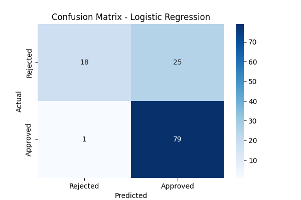

# Loan Approval Prediction

A machine learning classification project that predicts whether a loan application will be approved based on applicant financial and personal details.

## Problem Statement
Banks need to quickly assess loan applications. This project builds a model that predicts loan approval status using historical applicant data, helping automate initial screening.

## Dataset
- 614 records with 13 features including Gender, Marital Status, Education, Income, Credit History, and Property Area
- Target variable: Loan_Status (Approved/Rejected)

## Approach
1. **Data Cleaning** — Handled missing values using median (numerical) and mode (categorical) imputation
2. **Feature Encoding** — Converted categorical variables to numeric using Label Encoding
3. **Model Training** — Compared Logistic Regression and Random Forest classifiers
4. **Evaluation** — Used accuracy, confusion matrix, and classification report (precision/recall/F1)

## Results
| Model | Accuracy |
|---|---|
| Logistic Regression | 78.86% |
| Random Forest | 75.61% |

**Key Insight:** Both models showed strong performance predicting approvals (recall ~0.94-0.99) but weaker performance predicting rejections (recall ~0.42), indicating class imbalance in the dataset — a common challenge in real-world financial data.
## Confusion Matrix

## Tech Stack
- Python
- Pandas, NumPy
- scikit-learn
- Google Colab

## How to Run
1. Clone this repository
2. Open `loan_approval_prediction.ipynb` in Google Colab or Jupyter Notebook
3. Run all cells sequentially

## Future Improvements
- Address class imbalance using SMOTE or class weighting
- Deploy as a web app using Streamlit
- Try additional models (XGBoost, SVM)

## Author
Rishabh Tripathi
